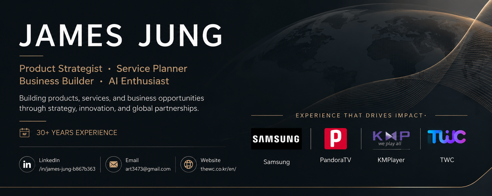
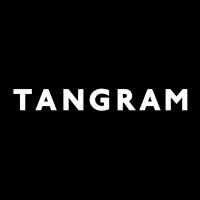

  

# James Jung

### Product Strategist • Service Planner • Business Builder • AI Enthusiast

Building products, services, and business opportunities through strategy, innovation, and global partnerships.

 

---

# Executive Summary

For more than 30 years, I have been involved in product strategy, service planning, business development, digital transformation, and emerging technologies.

My experience spans SaaS platforms, AI-powered customer engagement solutions, cryptocurrency ecosystems, IoT infrastructure, media platforms, startup ventures, and global business development.

I enjoy discovering opportunities in new industries, building strong teams, and creating products that generate meaningful business impact.

My passion lies in combining technology, strategy, and partnerships to create sustainable growth and innovation.

---

# Focus Areas

### Product Strategy

Transforming ideas into scalable products and sustainable businesses.

### Global Partnerships

Building long-term relationships and growth opportunities with international partners.

### Customer Experience

Creating products and services that improve customer engagement and operational efficiency.

---

# Featured Companies

 &nbsp;&nbsp;&nbsp;
 &nbsp;&nbsp;&nbsp;
 &nbsp;&nbsp;&nbsp;

  

**Samsung Electronics** • **PandoraTV** • **KMPlayer** • **TWC**

---

# Global Partnerships

Throughout my career, I have collaborated with leading international technology and media partners.

Google • ASK.com • VIKI • Softonic • Download.com • OpenCandy

---

# Career Journey

<table>

<tr>
<td width="90" align="center">

</td>

<td>

<b>Director of Product Group | TWC - CloudGate | 2023 - Present</b>

 

### Product Leadership

- Product strategy establishment
- Customer analysis framework development
- AI-powered customer engagement solutions
- Customer-centered solution planning

### Solutions

#### CloudGate

Integrated customer communication platform based on:

- Phone
- Chat
- Email
- AI Smart Response Systems

#### SellerGate

Customer service platform supporting:

- Smart Store
- Cafe24
- Corporate Mall
- Open Market Sellers

#### BPO Services

- CX Optimization
- Customer Support Operations
- Consulting Services

</td>
</tr>

<tr>
<td width="90" align="center">

</td>

<td>

<b>Director | Youngjin Crypto | 2019 - 2023</b>

 

### Business Management

- Product Production
- Service Planning
- China Communication
- Import Management
- Marketing
- Distribution
- Sales

### Key Initiatives

#### NextPlay

Cryptocurrency wallet ecosystem

#### NextGear

- Rugged Mobile Phones
- Smart Watches
- Chinese OEM Production

#### Blockchain Infrastructure

- NTON Network
- 56,924 Nodes

#### AI Robotics Advisory

Hurim Robot Advisor

- AI-powered robot task execution
- Web management systems
- Service robot strategy consulting

</td>
</tr>

<tr>
<td width="90" align="center">

</td>

<td>

<b>Director | CBI Platform | 2018 - 2019</b>

 

### Cryptocurrency Exchange

#### UIO Exchange

- Service Planning
- Product Strategy
- Exchange Operations

### Achievement

- Ranked Top 5 domestically by trading volume during operation
- Successfully acquired and sold

</td>
</tr>

<tr>
<td width="90" align="center">

</td>

<td>

<b>Managing Director | Triverse | 2017 - 2018</b>

 

### Business Areas

- Live Broadcasting Solutions
- Influencer Management
- Fashion E-Commerce
- Service Planning

Focused on building digital media ecosystems and creator platforms.

</td>
</tr>

<tr>
<td width="90" align="center">

</td>

<td>

<b>Founder & CEO | Innofrolic Inc. | 2016 - 2017</b>

 

### TravelTracks

Location-based travel platform helping independent travelers discover authentic experiences.

### Achievements

- Selected by Korea Tourism Organization
- Successfully launched on Apple App Store
- Secured early-stage investment
- Built founding team and business model

</td>
</tr>

<tr>
<td width="90" align="center">

</td>

<td>

<b>Strategic Advisor | Tangram Factory</b>

 

### Contributions

- Initial Series A investment support
- Team building
- Business model development
- Product production support

</td>
</tr>

<tr>
<td width="90" align="center">

</td>

<td>

<b>Vice President | KMPlayer | 2010 - 2014</b>

 

### Global Business Development

Focused on:

- Advertising Strategy
- Service Planning
- Partnership Development
- Revenue Growth

### Key Partnerships

- Google
- ASK.com
- VIKI
- Softonic
- Download.com
- OpenCandy

### Focus

Expanding global business opportunities and advertising ecosystems.

</td>
</tr>

<tr>
<td width="90" align="center">

</td>

<td>

<b>Service Planning Director | PandoraTV | 2007 - 2009</b>

 

### Responsibilities

- Product Planning
- Service Strategy
- User Growth
- Media Platform Development

### Focus

Building next-generation online video services.

</td>
</tr>

<tr>
<td width="90" align="center">

</td>

<td>

<b>Samsung Design Membership | Samsung Electronics | 1993 - 1997</b>

 

Participated in Samsung's prestigious design program focused on:

- Creative Thinking
- Design Innovation
- Industry Collaboration
- Product Development

This experience laid the foundation for my long-term approach to product and service strategy.

</td>
</tr>

</table>

---

# Philosophy

I enjoy entering unfamiliar industries and creating opportunities where others see uncertainty.

I believe success comes from:

- Curiosity over comfort
- Action over hesitation
- Collaboration over individual achievement

The most rewarding achievements are not personal victories, but the successes built together with a team.

---

# Current Focus

- Product Strategy
- Customer Experience Innovation
- AI-Powered Services
- Digital Transformation
- Global Business Development

---

### Building Products. Creating Opportunities. Driving Innovation.

